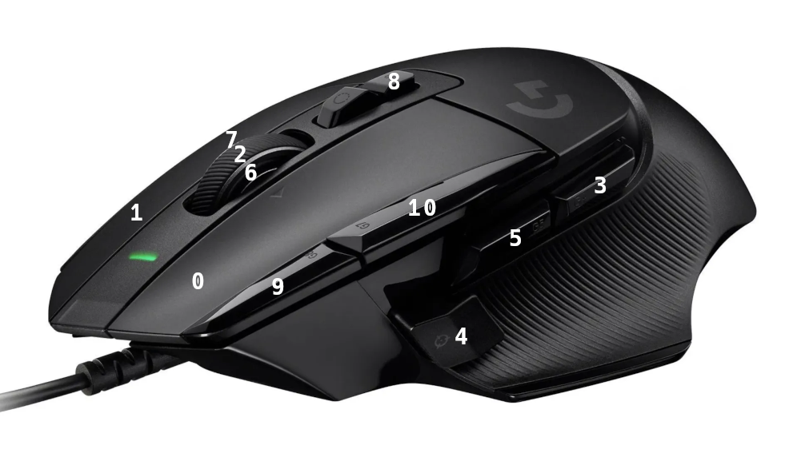

## LOGITECH G502 X

### INTRO

The script requires libratbag which provides ratbagctl. The script does not perform all of the functions available with ratbagctl.

The intention of the ratbagger.sh script is to make it easier to load different profiles onto the mouse and set the active one. The script relies upon one or more profile configuration files which are stored in the 'profiles' directory. A couple of sample files are included.

### BASIC SCRIPT USAGE

Mouse buttons typically start with the number 1, however libratbag starts with button 0 which is equivalent to mouse button 1, the left primary button. See the image above for reference when writing configuration files.

When mapping mouse buttons to keyboard keys, a valid key name must be used, all of which start with "KEY_". See the tables below. If you want to map a button to a key which isn't included in the tables, you will need to locate your key code file in order to find the key name. You can try looking in `/usr/include/linux/input-event-codes.h`.

You can have as many configuration profiles as you want in the 'profiles' directory, but only 5 can be loaded on the mouse. The files must have a '.ini' extension. See the included sample configuration files for reference.

Following are some examples of specifying macros:

* press and release '1', press 'Left Ctrl', press and release 'A', release 'Left Ctrl': `KEY_1 +KEY_LEFTCTRL KEY_A -KEY_LEFTCTRL`
* press 'A', pause 1 second, release 'A': `+KEY_A t1000 -KEY_A`

To run the script, `cd` to the script directory and run `./ratbagger.sh`.

### KNOWN ISSUES

* Although `profile name=Some Name` can be used in configuration files to assign a name to a profile, there's a bug in ratbagctl that prevents writing the profile name to the mouse, therefore these lines are commented out in the sample configuration files (see: https://github.com/libratbag/libratbag/issues/680).

### G502 X AVAILABLE DPI SETTINGS

100 150 200 250 300 350 400 450 500 550 600 650 700 750 800 850 900 950 1000 1100 1200 1300 1400 1500 1600 1700 1800 1900 2000 2100 2200 2300 2400 2500 2600 2800 3000 3200 3400 3600 3800 4000 4200 4400 4600 4800 5000 5500 6000 6500 7000 7500 8000 8500 9000 9500 10000 10500 11000 11500 12000 12500 13000 13500 14000 14500 15000 15500 16000 16500 17000 17500 18000 18500 19000 19500 20000 20500 21000 21500 22000 22500 23000 23500 24000 24500 25000 25500

### G502 X AVAILABLE USB POLLING FREQUENCIES (Hz)

125 250 500 1000

### G502 X SPECIAL ACTIONS

The following are special actions which can be mapped to mouse buttons. If you use any of these special actions in a configuration file, you may want to duplicate them in any other configuration files.

|      DESCRIPTION      |  SPECIAL ACTION NAME |
| --------------------- | -------------------- |
| cycle profiles up     | profile-cycle-up     |
| cycle profiles down   | profile-cycle-down   |
| cycle resolution up   | resolution-up        |
| cycle resolution down | resolution-down      |
| sniper resolution     | resolution-alternate |

### COMMON KEYBOARD KEYS

|     DESCRIPTION      |    KEY NAME    |
| -------------------- | -------------- |
| Function Keys F1-F12 | KEY_F[1-12]    |
| Number Keys 0-9      | KEY_[0-9]      |
| Letter Keys A-Z      | KEY_[A-Z]      |
| Apostrophe           | KEY_APOSTROPHE |
| Backslash            | KEY_BACKSLASH  |
| Backspace            | KEY_BACKSPACE  |
| Caps Lock            | KEY_CAPSLOCK   |
| Comma                | KEY_COMMA      |
| Delete               | KEY_DELETE     |
| Dot                  | KEY_DOT        |
| Down                 | KEY_DOWN       |
| End                  | KEY_END        |
| Enter                | KEY_ENTER      |
| Equals               | KEY_EQUAL      |
| Escape               | KEY_ESC        |
| Forward Slash        | KEY_SLASH      |
| Grave                | KEY_GRAVE      |
| Home                 | KEY_HOME       |
| Insert               | KEY_INSERT     |
| Left                 | KEY_LEFT       |
| Left Alt             | KEY_LEFTALT    |
| Left Brace           | KEY_LEFTBRACE  |
| Left Control         | KEY_LEFTCTRL   |
| Left Meta            | KEY_LEFTMETA   |
| Left Shift           | KEY_LEFTSHIFT  |
| Minus                | KEY_MINUS      |
| Num Lock             | KEY_NUMLOCK    |
| Page Down            | KEY_PAGEDOWN   |
| Page Up              | KEY_PAGEUP     |
| Pause                | KEY_PAUSE      |
| Right                | KEY_RIGHT      |
| Right Alt            | KEY_RIGHTALT   |
| Right Brace          | KEY_RIGHTBRACE |
| Right Control        | KEY_RIGHTCTRL  |
| Right Meta           | KEY_RIGHTMETA  |
| Right Shift          | KEY_RIGHTSHIFT |
| Scroll Lock          | KEY_SCROLLLOCK |
| Semicolon            | KEY_SEMICOLON  |
| Space                | KEY_SPACE      |
| Tab                  | KEY_TAB        |
| Up                   | KEY_UP         |

### KEYPAD KEYS

|   DESCRIPTION   |    KEY NAME    |
| --------------- | -------------- |
| Asterisk        | KEY_KPASTERISK |
| Comma           | KEY_KPCOMMA    |
| Dot             | KEY_KPDOT      |
| Enter           | KEY_KPENTER    |
| Equals          | KEY_KPEQUAL    |
| Forward Slash   | KEY_KPSLASH    |
| Minus           | KEY_KPMINUS    |
| Number Keys 0-9 | KEY_KP0-9      |
| Plus            | KEY_KPPLUS     |

### MEDIA KEYS

| DESCRIPTION |     KEY NAME     |
| ----------- | ---------------- |
| Back        | KEY_BACK         |
| Forward     | KEY_FORWARD      |
| Mute        | KEY_MUTE         |
| Next        | KEY_NEXTSONG     |
| Play/Pause  | KEY_PLAYPAUSE    |
| Previous    | KEY_PREVIOUSSONG |
| Stop        | KEY_STOP         |
| Volume Down | KEY_VOLUMEDOWN   |
| Volume Up   | KEY_VOLUMEUP     |

### RATBAGCTL COMMAND EXAMPLES

Following are some examples of ratbagctl commands if you need to use it directly.

* list devices: `ratbagctl list` (the remainder of the examples are specific to the Logitech G502 X)
* get device info: `ratbagctl 'Logitech G502 X' info`
* set USB polling rate: `ratbagctl 'Logitech G502 X' profile <0-4> rate set <see table above>`
* enable a profile: `ratbagctl 'Logitech G502 X' profile <0-4> enable`
* disable a profile: `ratbagctl 'Logitech G502 X' profile <0-4> disable`
* set currently active profile: `ratbagctl 'Logitech G502 X' profile active set <0-4>`
* set default resolution profile: `ratbagctl 'Logitech G502 X' profile <0-4> resolution default set <0-4>`
* set active resolution profile: `ratbagctl 'Logitech G502 X' profile <0-4> resolution active set <0-4>`
* set DPI for given resolution profile: `ratbagctl 'Logitech G502 X' profile <0-4> resolution <0-4> dpi set <see table above>`
* map one mouse button to another: `ratbagctl 'Logitech G502 X' profile <0-4> button <0-10> action set button <0-10>`
* map mouse button to keyboard key: `ratbagctl 'Logitech G502 X' profile <0-4> button <0-10> action set macro <key name>`
* map mouse button to a special action: `ratbagctl 'Logitech G502 X' profile <0-4> button <0-10> action set special <special action>`
